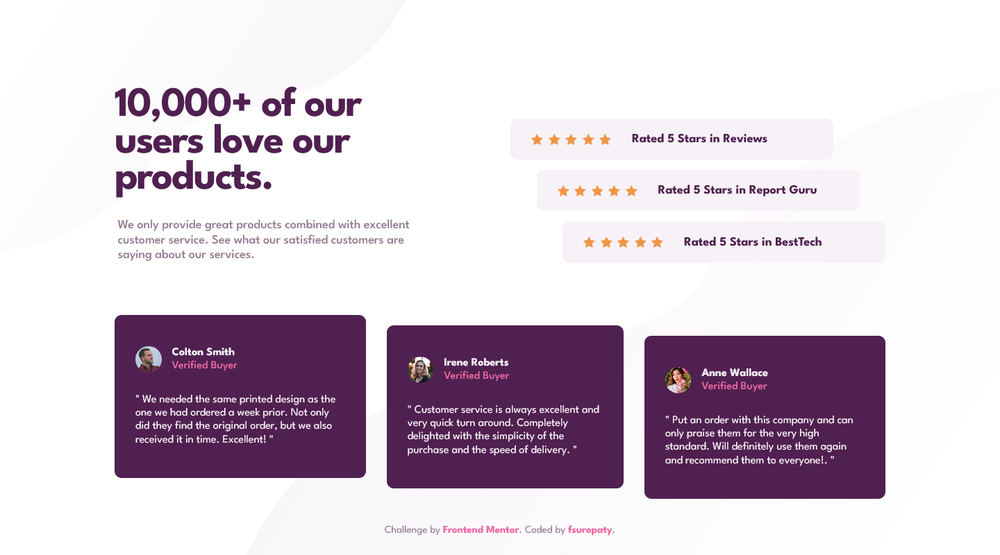
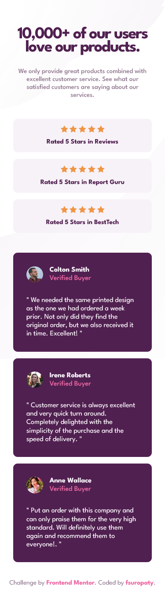

# Frontend Mentor - Social proof section solution

This is a solution to the [Social proof section challenge on Frontend Mentor](https://www.frontendmentor.io/challenges/social-proof-section-6e0qTv_bA). Frontend Mentor challenges help you improve your coding skills by building realistic projects.

## Table of contents

- [Frontend Mentor - Social proof section solution](#frontend-mentor---social-proof-section-solution)
  - [Table of contents](#table-of-contents)
  - [Overview](#overview)
    - [The challenge](#the-challenge)
    - [Screenshot](#screenshot)
    - [Links](#links)
  - [My process](#my-process)
    - [Built with](#built-with)
    - [What I learned](#what-i-learned)
    - [Useful resources](#useful-resources)
  - [Author](#author)

## Overview

### The challenge

Users should be able to:

- View the optimal layout for the section depending on their device's screen size

### Screenshot




### Links

- Solution URL: [Add solution URL here](https://your-solution-url.com)
- Live Site URL: [Add live site URL here](https://your-live-site-url.com)

## My process

### Built with

- Semantic HTML5 markup
- CSS custom properties
- Flexbox
- CSS Grid
- Mobile-first workflow

### What I learned

I learned about :

- CSS combinator
- Selecting specific child of elements in CSS

```css
/* Combinator */

.title > p {
  text-align: center;
  margin: 0;
  margin-bottom: 3rem;
  color: var(--Dark-Grayish-Magenta);
  font-weight: 500;
  font-size: 1rem;
  padding: 0 0.3rem;
}

/* Select specific child */
.rating:nth-child(2) {
  margin-left: 5rem;
}
.rating:nth-child(3) {
  margin-left: 10rem;
}
```

### Useful resources

- [W3Schools](https://www.w3schools.com) - Pretty much your guidebook in website development
- [MDN](https://developer.mozilla.org) - W3Schools but from Mozilla.

## Author

- Website - [fsuropaty]()
- Frontend Mentor - [@fsuropaty](https://www.frontendmentor.io/profile/fsuropaty)
